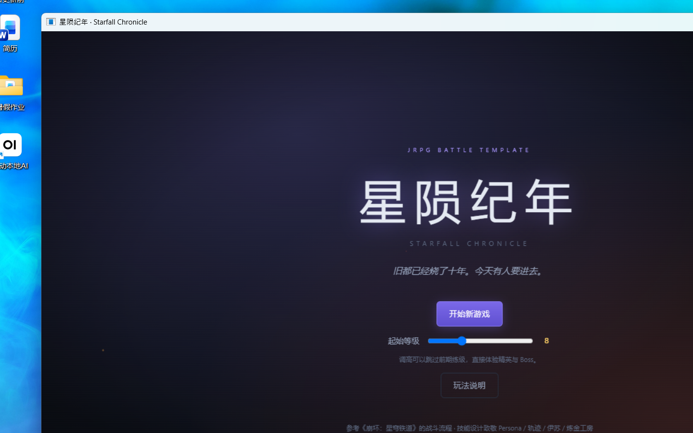
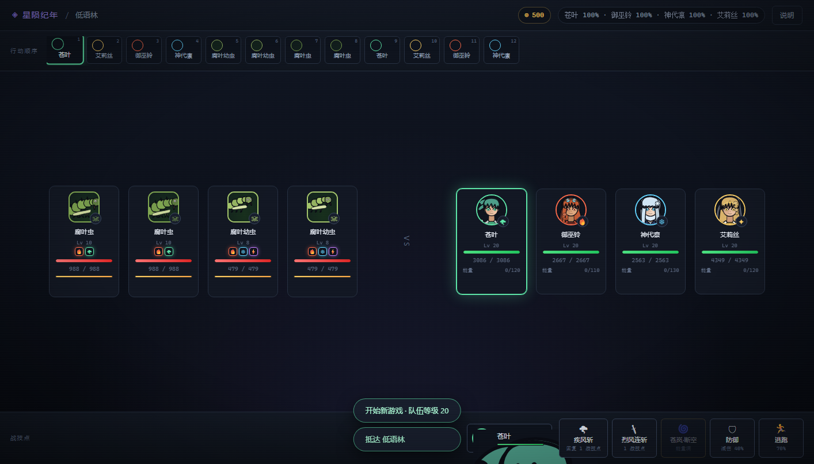
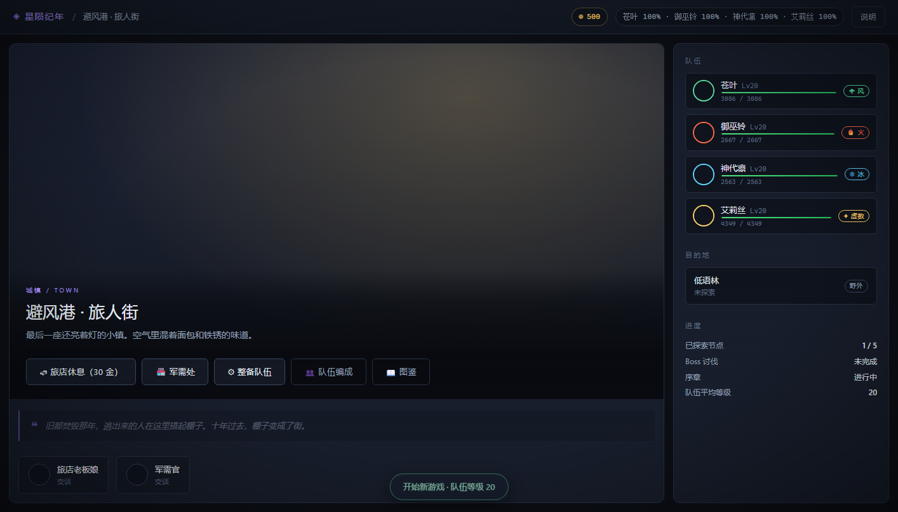
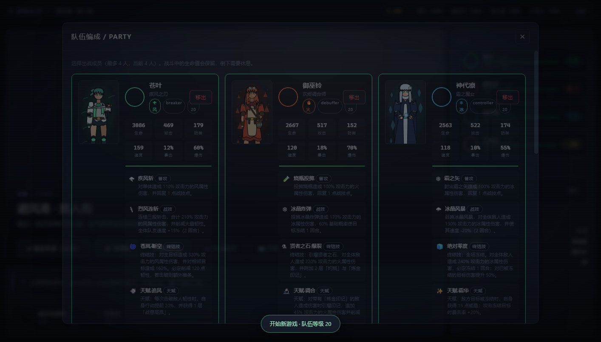
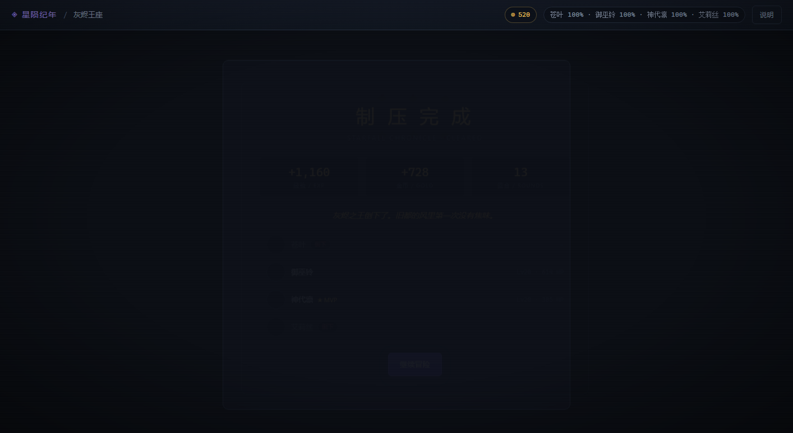
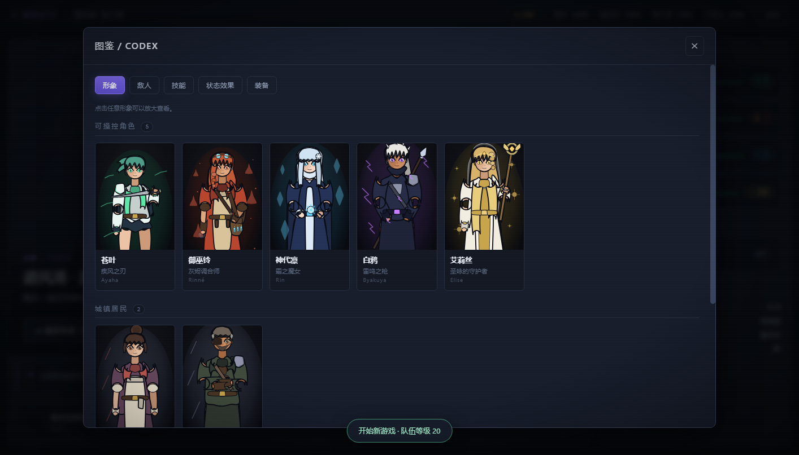
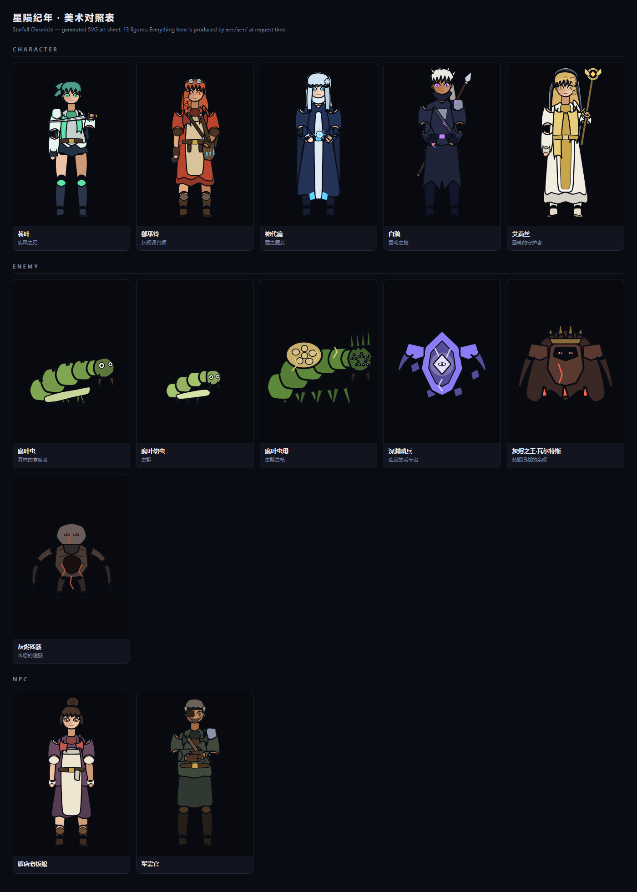

# 星陨纪年 / Starfall Chronicle

**一个零依赖的 JRPG 战斗模板与可玩 Demo。**

[](https://github.com/leerogerstheman/StarfallChronicle/releases/tag/v0.2.0)
[](LICENSE)
[](package.json)

战斗流程参考《崩坏：星穹铁道》（行动条推条、弱点击破、战技点、终结技插入），
角色技能与效果设计致敬 Persona（状态异常与弱点）、轨迹（导力魔法与推条）、
伊苏（高速连击与闪避）、炼金工房（道具调合与引爆）。

**双击 `start.bat` 就能玩。** 不需要 `npm install`，不需要构建，不需要联网，
**也不需要浏览器**——游戏跑在自己的原生窗口里。

**所有人物形象都是代码生成的 SVG。** 5 名角色的全身立绘与战斗头像、6 种敌人插画
（含 Boss 二阶段）、城镇 NPC 头像，全部由 `src/art/` 在请求时算出来。
没有一张位图，没有一个外部素材。

```
双击  start.bat
→ 弹出独立窗口「星陨纪年 · Starfall Chronicle」
→ 选起始等级，点「开始新游戏」
→ 城镇操作栏点「📖 图鉴」看全部 13 个形象
```

首次运行会自动用 Windows 自带的 C# 编译器把窗口启动器编出来（约 2 秒），
之后每次都是秒开。

---

## 下载

| 方式 | 怎么做 | 适合 |
|---|---|---|
| **发行包** | [Releases](https://github.com/leerogerstheman/StarfallChronicle/releases/latest) 下载 zip，解压，双击 `start.bat` | 只想玩 |
| **克隆仓库** | `git clone` 后双击 `start.bat` | 想看代码 / 改东西 |

两种方式都**只需要装 Node.js 22 或更新版本**，其余什么都不用装。
原生窗口启动器在首次运行时用 Windows 自带的编译器现场构建。

完整变更历史见 [`CHANGELOG.md`](CHANGELOG.md)。

---











### 全部 13 个形象

游戏里点城镇的 **📖 图鉴** 就能看到它们：一个按「可操控角色 / 城镇居民 / 敌人」分组的画廊，
点任意一张可以放大，右侧列出称号、属性、定位、背景故事，
角色还会并排列出**全部四种表情**，灰烬之王则并排列出**两个阶段**。



下面是 `node tools/art-sheet.js` 生成的对照表（由无头浏览器渲染并逐张测量）：



---

## 一、这个项目是什么

两样东西合在一起：

**它是一个模板。** `src/` 是一套数据驱动的回合制战斗引擎。加一个新角色、
新技能、新敌人、新地图节点，都是**改数据文件**，不改引擎代码。
`src/core/skills.js` 里的一个技能就是一段声明式效果列表；
`src/core/enemies.js` 里的一个 Boss 就是属性 + 技能表 + AI 描述符。

**它也是一个能从头玩到尾的 Demo。** 5 名可操控角色、小怪/精英/Boss 三段战斗、
一张有 5 个节点的地图、城镇服务（旅店/军需处/队伍编成）、升级与装备成长、
Boss 战两阶段 + 召唤 + 蓄力终结技。序章可以通关。

**它还自带一套原创人物美术。** 立绘、头像、敌人插画、NPC 头像都是
`src/art/` 里的纯函数生成的矢量图——加一个新角色，是写一条 spec，不是找画师。
详见 [`docs/ART.md`](docs/ART.md)。

---

## 二、快速开始

### 玩

```
双击  start.bat
```

游戏在自己的原生窗口里打开，有自己的标题栏、任务栏图标和窗口图标，
不占用浏览器标签页。服务器会自动跑一遍自检（59 项），全部通过才启动窗口。

窗口模式下：

| 操作 | 效果 |
|---|---|
| 关闭窗口 | 后台的 Node 进程一起结束，不留孤儿进程 |
| <kbd>F11</kbd> / 最大化 | 全屏游玩 |
| <kbd>Ctrl</kbd>+<kbd>+</kbd> / <kbd>-</kbd> | 缩放 |
| 右键 | 已禁用（避免出现浏览器菜单） |

想换端口：

```
start.bat --port 9000
```

想用浏览器（或者在没有图形界面的机器上）：

```
start.bat --console          # 只跑服务器，打印地址
start.bat --console --open   # 顺便打开默认浏览器
```

如果本机没装 WebView2 运行时，启动器会**自动退回默认浏览器**并在窗口里说明，
游戏照样能玩，不会报错退出。

### 验证

```
双击  verify.bat              # 引擎 + 集成 + 平衡性 + 原生窗口
双击  verify.bat --browser    # 再加上真实浏览器全流程
双击  verify.bat --fast       # 跳过原生窗口那一项（最慢的一项）
```

四套测试，全绿才叫通过：

| 套件 | 项数 | 测什么 |
|---|---|---|
| `test/run-all.js` | 60 | 引擎不变式、确定性、成长曲线、版本号一致性 |
| `test/integration.js` | 39 | HTTP 端到端：会话、地图、战斗、通关、美术路由 |
| `test/art.js` | 21 | 美术覆盖完整性、SVG 合法性、几何边界、设计约束 |
| `test/balance.js` | 5 组遭遇 | 胜率与回合数（带 95% 置信区间）|
| `test/desktop.js` | 8 | 构建启动器、开原生窗口、关窗口不留孤儿进程 |
| `test/browser.js` | 22 | 真实浏览器里从城镇打到 Boss，并断言头像真的解码成功 |

或者用 npm 脚本：

```bash
npm run selftest      # 引擎自检（60 项）
npm run integration   # HTTP 集成（39 项）
npm run art           # 美术生成（21 项）
npm run desktop       # 原生窗口（8 项）
npm run browser       # 浏览器全流程（22 项）
npm run balance       # 平衡性测试
```

`test/desktop.js` 值得一提：它**真的会开一个窗口**，从操作系统读回窗口标题
（要求中英文两半都对，防止编码悄悄坏掉），然后用 `taskkill`（不带 `/F`，
即发 `WM_CLOSE`）关掉它，再断言后台的 Node 进程已经消失。
机器上没有 WebView2 运行时时，窗口那几项会**明确报告跳过**，不会伪装成通过。

`test/browser.js` 里关于美术的那几项用的是 `img.naturalWidth > 0`。
断言"`src` 存在"会在 404 上通过，断言"元素存在"会在坏 SVG 上通过，
只有**真的解码成功**才是需求本身。

### 看美术

```
node tools/art-sheet.js            # 生成 docs/art-sheet.png 并逐张测量
node tools/art-sheet.js --kind enemy
node tools/render-art.js           # 把每张 SVG 写到临时目录
node tools/render-art.js --bounds  # 每一层的几何边界，用来定位"哪一层出画布了"
```

---

## 三、玩法（战斗流程）

### 行动条

顶部「行动顺序」是你需要一直盯的地方。

每个单位有一条**行动值**，达到 10000 就行动一次。每推进一格，所有单位增加
等于自身速度的行动值。所以速度 200 的单位 50 格行动一次，速度 100 的要 100 格——
这就是「速度决定行动频率」，且没有百分比进度条的取整问题。

行动后行动值归零。**推条**（延迟）减去行动值，**拉条**（提前）加上行动值。
因为都是绝对值，推条效果天然可叠加、可预期。

### 战技点

全队共享，上限 5，开局 3。

| 动作 | 战技点 |
|---|---|
| 普攻 | **+1** |
| 战技 | **−1** |
| 终结技 | 0（消耗能量） |
| 防御 | 0 |

### 韧性 / 弱点击破

每个敌人有一条**韧性条**（黄色）。用它的**弱点属性**攻击能全额削韧，
非弱点属性只能削一半。韧性归零即**击破**：

- 造成一次大额击破伤害
- 把敌人**推条**（行动顺序后退）
- 移除它身上的增益（护盾、减伤、韧性强化）
- 已有的减益会保留，所以「先上灼烧再击破」是有意义的连段

击破的敌人会在自己下一次行动后恢复韧性。**这是本作最主要的节奏手段**：
不是比谁伤害高，而是比谁能更快把敌人打进击破窗口。

### 终结技插入

能量满时，右下角会弹出提示，角色头像上也会亮起标记。

按 <kbd>Q</kbd> 或点击提示，可以**在我方回合之外**插入终结技——
包括在敌人回合中间。插入不消耗回合、不改变行动条位置。

这是最「星穹铁道」的一条规则，也是这个 demo 里最强的战术资源：
把两个角色的终结技攒到同一个击破窗口里连发，伤害是单发的数倍。

### 快捷键

| 键 | 作用 |
|---|---|
| <kbd>1</kbd> | 普攻 |
| <kbd>2</kbd> | 战技 |
| <kbd>3</kbd> | 终结技 |
| <kbd>Q</kbd> | 插入终结技（任意时刻） |
| <kbd>Space</kbd> | 推进 / 继续 |
| <kbd>Esc</kbd> | 取消选择 / 关闭窗口 |

### 在哪看人物

| 位置 | 看到什么 |
|---|---|
| 城镇 → **📖 图鉴** | 13 个形象的画廊，点击放大，含全部表情与 Boss 两阶段 |
| 城镇 → 队伍编成 | 每个角色一张全身立绘（点图放大），右侧是属性、技能、装备 |
| 城镇 → NPC | 旅店老板娘与军需官的头像，点击交谈 |
| 战斗 | 每个单位的头像、行动条、当前行动者；血量低于 30% 自动换成「受击」表情 |
| 战斗结算 | 队伍每人一张头像（胜利与倒下用不同表情）|
| 图鉴 → 敌人 | 敌人资料表，每行带缩略图 |

---

## 四、5 名角色

每人一个**独特的动词**，覆盖引擎的四种机械支柱。

| 角色 | 定位 | 玩法 | 致敬 |
|---|---|---|---|
| **苍叶** Ayaha | 风 · 击破手 | 三段连斩高削韧；每次击破让自己行动提前 20% 并叠攻击——越打越快 | 伊苏的高速连击 |
| **御巫铃** Rinné | 火 · 减益 | 叠灼烧与「炼金印记」；**每次命中都会引爆一层印记**追加火伤 | 炼金工房的道具调合 |
| **神代凛** Rin | 冰 · 控制 | 群体冻结与减速；冻结敌人会返还能量，让她能连发终结技 | 轨迹的导力魔法 |
| **白鸦** Byakuya | 雷 · 节奏 | 大幅推条 + 自身加速；终结技按目标身上的**减益层数**增伤（每层 +12%） | 轨迹的延迟战技 |
| **艾莉丝** Elise | 虚数 · 辅助 | 治疗、解减益、护盾、全队增伤；残血队友自动获得「不屈」 | 炼金/轨迹的辅助位 |

### 一个具体连段

> 白鸦战技推条 → 御巫铃终结技上 2 层灼烧 + 2 层印记 → 苍叶战技三段连斩
> （每段都引爆一层印记）→ 韧性归零**击破** → 苍叶天赋让她行动提前 → 
> 凛终结技冻结 → 白鸦终结技吃掉 4 层减益打爆发

---

## 五、三段战斗

| 战斗 | 弱点 | 打法 |
|---|---|---|
| **小怪** 腐叶虫 / 幼虫 / 虫母 | 火 · 冰 · 雷 · 风 | 教学：认识弱点与击破。虫母会召唤，优先杀召唤者 |
| **精英** 深渊哨兵 | **只有风 · 雷** | 它抵抗火与冰，所以御巫铃和神代凛必须转为辅助/减益。需要真正的战技循环 |
| **Boss** 灰烬之王·瓦尔特斯 | 一阶段 **冰 · 虚数**<br>二阶段追加 **风** | 两阶段 + 召唤灰烬残骸 + 蓄力全屏终结技 |

### Boss 机制

1. **劫火印记**：Boss 每 3 回合给自己叠 2 层印记并回血。
2. **烬灭新星**：攒够 3 层印记后释放全屏终结技，**每层 +15% 伤害**，然后清空层数。
3. **阶段转换**：生命降到 50% 时，清除自身减益、攻击 +15%、速度 +10%、清场小怪，
   并**获得风弱点**——这是给带了击破手的玩家的奖励。
4. **遗言**：生命低于 20% 时释放一次 380% 攻击力的全屏重击。

**关键**：在它攒够 3 层之前把它击破。击破会移除它的增益并推条，
是新星伤害最低、也是你唯一能安全输出的窗口。

### 平衡性目标

`npm run balance` 会跑完整的三段战斗并检查设计意图：

```
小怪波次        胜率 100%    2.0 回合    应当轻松，用来教学
精英：深渊哨兵   胜率 100%    5.0 回合    需要真正的战技循环
Boss：灰烬之王   胜率  79%   25.3 回合    满配队伍应当能赢，但会掉人
Boss（等级不足） 胜率  29%   48.6 回合    等级不足应当明显吃亏
```

Boss 战在等级 18 / 20 / 21 下的胜率分别是 100% / 100% / 83%——
等级差异是真实存在的，这给玩家升级的动机。

---

## 六、项目结构

```
D:\StarfallChronicle\
├─ start.bat                 启动（纯 ASCII，先切代码页再交给 Node）
├─ build-desktop.bat         编译原生窗口启动器（用 Windows 自带的 csc.exe）
├─ verify.bat                跑全部验证
├─ CHANGELOG.md              更新日志
├─ package.json              零依赖，只有 scripts
│
├─ desktop/                  ← 原生窗口启动器
│  ├─ Launcher.cs            WinForms + WebView2 宿主（~600 行，含注释）
│  ├─ webview2-sdk/          vendored 的 WebView2 托管程序集（随 MIT 许可分发）
│  └─ bin/                   编译产物（.gitignore，首次运行自动生成）
│
├─ src/
│  ├─ server.js              入口：启动前先自检，不通过就拒绝启动
│  ├─ config.js              端口 / 绑定地址
│  │
│  ├─ art/                   ← 人物美术（纯函数：spec 进，SVG 字符串出）
│  │  ├─ svg.js              构造器 + Catmull-Rom 插值
│  │  ├─ palette.js          配色、明暗、对比度
│  │  ├─ body.js             人体骨架、四肢、头、手、脚
│  │  ├─ face.js             五官 + 四种表情（参数化）
│  │  ├─ hair.js             7 种发型
│  │  ├─ outfits.js          服装零件（外套/裙摆/袖/靴/手套/领/腰带/披风/护肩）
│  │  ├─ gear.js             武器与道具（刀/枪/法球/圣杖/行囊）
│  │  ├─ motifs.js           元素氛围（风/火/冰/雷/虚数/量子/孢子/余烬）
│  │  ├─ human.js            按固定图层顺序组装人形
│  │  ├─ creature.js         按固定图层顺序组装非人形
│  │  ├─ specs/              13 个形象的"画什么"（角色 5 / 敌人 6 / NPC 2）
│  │  └─ index.js            renderArt() + 清单 + 缓存
│  │
│  ├─ core/                  ← 纯数据与纯函数，不依赖战斗状态
│  │  ├─ rules.js            所有可调数值（伤害公式、行动条、成长曲线）
│  │  ├─ skills.js           42 个技能，全部是声明式效果列表
│  │  ├─ status.js           44 种状态效果（增益/减益/DoT/控制/特殊）
│  │  ├─ characters.js       5 名角色 + 11 件装备
│  │  ├─ enemies.js          6 种敌人 + AI 描述符
│  │  ├─ items.js            8 件消耗品
│  │  ├─ world-data.js       5 个地图节点、遭遇表、商店、NPC
│  │  ├─ damage.js           伤害管线（每一步都有注释说明为什么）
│  │  ├─ entity.js           单位模型与属性结算
│  │  ├─ progression.js      等级、经验、装备、存档形状
│  │  ├─ rng.js              确定性随机（mulberry32）
│  │  └─ log.js              结构化事件流
│  │
│  ├─ battle/                ← 战斗引擎
│  │  ├─ battle.js           状态机：行动条、战技点、终结技插入、击破
│  │  ├─ resolve.js          技能效果解释器 + 状态施加
│  │  ├─ ai.js               敌人 AI（声明式，加敌人不用写代码）
│  │  ├─ scripts.js          14 个命名脚本处理器（天赋、Boss 机制）
│  │  └─ action-constants.js 共享常量（用来打破 require 循环）
│  │
│  ├─ world/
│  │  └─ game.js             会话层：队伍、地图、遭遇、结算、城镇服务
│  │
│  └─ api/
│     └─ server.js           HTTP 路由 + 静态文件服务（零依赖）
│
├─ public/                   ← 前端（无框架、无构建）
│  ├─ index.html
│  ├─ css/style.css          一个样式表，自定义属性 + grid
│  └─ js/
│     ├─ api.js              API 客户端 + 错误码到人话的映射
│     ├─ ui.js               DOM 构建器、toast、modal
│     ├─ art.js              美术清单、URL 拼装、战斗前预加载
│     ├─ battle.js           战斗演出：事件重放、伤害数字、终结技提示
│     ├─ world.js            城镇、队伍、商店、图鉴
│     └─ main.js             启动、路由、快捷键
│
├─ tools/                    ← 开发工具（不参与游戏运行）
│  ├─ art-sheet.js           渲染对照表 + 无头浏览器逐张测量
│  └─ render-art.js          导出 SVG；--bounds 定位哪一层出了画布
│
├─ test/
│  ├─ run-all.js             59 项引擎自检
│  ├─ integration.js         39 项 HTTP 端到端
│  ├─ art.js                 21 项美术结构自检（纯 Node）
│  ├─ balance.js             平衡性测试（带置信区间）
│  ├─ desktop.js             8 项原生窗口（会真的开窗、真的关窗）
│  ├─ browser.js             20 项真实浏览器全流程
│  ├─ lib/cdp.js             共享的 CDP 客户端与浏览器启动器
│  ├─ probe.js               调试：采样渲染时序
│  ├─ interact.js            调试：单次交互探针
│  └─ inspect.js             调试：导出实际页面状态
│
└─ docs/
   ├─ ARCHITECTURE.md        架构决策与踩坑记录
   ├─ ART.md                 美术系统：骨架、图层、曲线、怎么加人
   ├─ TEMPLATE.md            怎么加角色/技能/敌人/地图
   └─ art-sheet.png          13 个形象的对照表（工具生成）
```

---

## 七、架构

### 三层，单向依赖

```
core/  (纯数据与纯函数)
  ↓
battle/ + world/  (状态机)
  ↓
api/  (HTTP)
  ↓
public/  (渲染)
```

**引擎从不在客户端运行。** 浏览器只做两件事：发指令，渲染服务端返回的状态。
这样规则只有一份实现，客户端不可能与服务端不同步。
代价是每次操作一个 HTTP 往返——本地服务器上是 1ms 量级，完全够用。

### 一切状态都是推导出来的

角色的持久状态只有：等级、经验、装备 id、已解锁天赋。
所有属性在每次需要时从 `characters.js` 重新推导。

好处：**改 `characters.js` 里的基础属性，会立刻正确影响所有已有存档。**
这在开发期极其有用——调平衡不需要迁移存档。

### 事件流，而非返回值

引擎不碰 DOM。它把结构化事件（`combat.damage`、`combat.break`、
`ultimate.ready`…）推进一个 `Log`。前端把事件一条条重放成动画。

这带来三个好处：

1. 平衡性测试可以在进程内跑上万场战斗，完全不需要浏览器
2. 前端可以用 `prefers-reduced-motion` 降级，而状态依然正确
3. 未来做战斗回放只需要存一份事件流 + 种子

### 确定性

所有随机都走 `Rng`（mulberry32）。同一颗种子 + 同一串指令 = 完全相同的战斗。

这让「我第 12 回合被 Boss 打死了」可以被精确复现，也让平衡性测试的数字不会漂。
`test/run-all.js` 里有一项就是验证这一点。

### 数据驱动到什么程度

加一个新敌人，你**不需要写任何代码**：

```js
defineEnemy({
  id: 'new_boss',
  name: '某 Boss',
  level: 25,
  baseStats: { maxHp: 8000, atk: 180, def: 120, spd: 140, /* … */ },
  toughness: 420,
  weaknesses: ['ice', 'imaginary'],
  resist: { fire: 0.3 },
  skills: ['boss_slash', 'boss_nova'],
  ai: {
    policy: 'boss',
    script: [{ turn: 1, skill: 'boss_slash' }],      // 前三回合硬编
    phases: [{ atHpRatio: 0.5, skill: 'boss_phase2', once: true, phaseTo: 2 }],
    finishers: [{ atHpRatio: 0.2, skill: 'boss_lastword', once: true }],
    ultRequiresStacks: { status: 'doom', min: 3 },   // 攒够 3 层才放大招
    skillCooldowns: { boss_nova: 2 },                // 关键：防止刷自愈
    actionsPerTurn: 2,                               // 一回合动两次
    targeting: 'highestAtk',
  },
});
```

详见 [`docs/TEMPLATE.md`](docs/TEMPLATE.md)。

### 人物美术：代码生成的 SVG

`src/art/` 是一组纯函数：一个 spec 进，一个 SVG 字符串出。
`GET /art/character/ayaha.svg?view=bust&expression=hurt` 就是一次调用。

**为什么生成而不是画好存起来。** 项目的承诺是"双击就能玩"，
美术如果是文件就需要一个生成/导出环节，也就多了一个会不同步的东西。
生成还带来两个额外好处：角色名从 `characters.js` 读，改名不会对不上；
以及**可以测试**——生成的东西能被断言。

**五个角色画在同一副骨架上。** 比例、四肢粗细、肩宽、头身比写死在
`body.js`，spec 只决定发型、服装、道具、配色、姿势、身高。
难用眼睛判断的部分（手肘在哪、胯比肩宽多少）只决定一次，这是让五个形象
像同一套人的唯一办法。身高用 `spec.scale` 以地面为锚点缩放，0.95–1.03。

**曲线是 Catmull-Rom，不是手写贝塞尔。** 所有有机形状由锚点列表定义，
插值成三次贝塞尔。改刘海是改一个坐标，不是重画四段控制点。

**图层顺序就是设计本身。** 平面矢量人物"看起来不对"几乎总是图层放错了。
顺序定死在 `human.js` 的 `ORDER` 里，`test/art.js` 断言这个列表：
靴子在衣服之前（长下摆要盖住靴口）、握在手里的武器在手之前（手指才是"握"上去的）、
背在身后的长枪在衣服之前（外套遮住中段才叫"背着"）。

**表情是四个参数，不是四张画。** 眼型开合度、眉角、眉高、嘴形曲线。
几何共享，所以"笑的脸"不可能和"平静的脸"错位。

**这套美术是在看不见成品的条件下写的**，所以有两层替代验证：
`test/art.js`（纯 Node，21 项）检查覆盖完整性、SVG 合法性、id 唯一性、
**几何是否超出画布**（三次贝塞尔落在控制点凸包内，所以检查所有输出坐标是保守上界）、
bust 裁切是否框住头、姿势/身高是否重复；
`tools/art-sheet.js` 在无头浏览器里把每张图栅格化后**读像素**——
覆盖率、包围盒、剪影两两 IoU、以及在 bust 上取固定点验证
"头顶是头发、双眼够暗、脸颊是暖肤色"。

五官取样是最值钱的一项：包围盒可以完美，而刘海已经长到眼睛上了。

详见 [`docs/ART.md`](docs/ART.md)。

### 原生窗口（不依赖浏览器）

`desktop/Launcher.cs` 是一个约 600 行的 WinForms 宿主，只干一件事：
**给游戏一个自己的窗口。**

```
Launcher.exe
  1. 找到项目根目录（exe 旁 / 工作目录，向上找 5 层，找 src\server.js）
  2. 找到 Node（PATH → Program Files → LOCALAPPDATA → 其它工具链自带的运行时）
  3. 若端口已被占用：直接连上去，不杀别人的进程
     否则：隐藏启动 src\server.js，接管它的生命周期
  4. 轮询 TCP 端口，直到能连上
  5. 打开窗口，把 WebView2 指向 http://127.0.0.1:<port>
  6. 窗口关闭 → 结束 Node → 退出
```

几个刻意的选择：

- **用 WebView2，而不是把界面重写成原生控件。**
  `public/css/style.css` 是这个项目里最值钱的部分之一（40KB，自定义属性 + grid +
  伤害数字动画 + 减弱动效降级）。改成 WinForms 控件只会更丑、更慢，
  还会让 17 项浏览器测试全部作废。WebView2 保留了唯一的渲染实现。
- **用轮询端口判断就绪，而不是解析子进程 stdout。**
  子进程的输出流不是服务端承诺过的契约；**监听中的 socket 才是**。
  服务端只会在自检全部通过之后才 bind 端口，所以「能连上」就等于「能玩」。
- **不请求任何提权，不写注册表，不装东西。**
  编译用的是 Windows 自带的 `csc.exe`（`build-desktop.bat`），
  所以没有 .NET SDK、没有 Visual Studio、没有 NuGet 也能构建。
- **缺 WebView2 就退回浏览器，而不是报错退出。**
  启动器会打开默认浏览器，并用一个对话框说明原因，游戏照样能玩。

`start.bat` 的逻辑是：窗口启动器不存在 → 用 `csc.exe` 现场编一个 → 运行。
连 `csc.exe` 都没有（或加了 `--console`）→ 退回纯 Node 服务器模式。

---

## 八、开发过程中发现并修掉的真问题

这些是引擎和前端里**实际存在过**、被测试抓出来的 bug。
每一个都在 `test/run-all.js` 里留了回归测试，注释里写清了「为什么」。

| 问题 | 症状 | 根因 |
|---|---|---|
| **等级成长被应用两次** | Boss 防御力 562 而不是 244，一场仗打 76 回合 | 预先按成长曲线缩放后，又把真实等级交给实体，`resolveStats` 再缩放一次 |
| **治疗技能能治敌人** | 艾莉丝的治疗被指向 Boss，一场仗给它回了 130,000 血 | `resolveSelector('primary')` 直接返回传入的 uid，不检查阵营 |
| **Boss 自愈无上限** | 一场仗自愈 172,525，比全队总伤害还多，永远打不死 | AI 能无限次选「回血」；加了冷却机制 |
| **召唤无累计上限** | 一场仗召唤 24 个残骸，伤害全打在杂兵上 | 只限制场上数量，没限制累计数量 |
| **阶段缩放累积** | Boss 攻击力 397 → 456 → 525 → … | 每次触发都乘一遍系数；改成按阶段幂等 |
| **事件类型被载荷覆盖** | 前端收不到任何 `skill.cast` 事件 | `Log.push` 先写 `kind` 再展开载荷，载荷里的 `kind: 'skill'` 覆盖了事件类型 |
| **指令的事件被丢弃** | 战斗日志永远是空的，没有任何演出 | `command()` 调用 `step()`，后者重新计算起始下标，把刚产生的事件跳过了 |
| **前端混用两种 view** | 点战技后敌人全部消失，无法选目标 | 把「战斗 view」合并进了「游戏 view」，`view.enemies` 变成 undefined |
| **DOM id 被渲染删除** | `#actor-name` 在第一次渲染后变成 null | 渲染时替换了容器的子节点，把带 id 的元素删掉了 |
| **战斗结束卡在 battle 模式** | 界面永远停在战斗，所有指令都被拒绝 | `takeTurn` 已经结束了战斗，但会话层没有结算 |
| **美术缓存键漏了一个选项** | 剪影测量全部带上背景光晕，覆盖率数字全是错的 | `renderArt` 的缓存键少写了 `plain`，第一次非 plain 渲染污染了缓存 |
| **SVG 坐标提取把属性名当数字** | 每个形象都像挂在画布左边（x = 1） | 正则匹配属性串里的所有数字，把 `x1` 里的 `1` 也算成了坐标 |
| **身高缩放把头发顶出画布** | 白鸦（1.03）和军需官（1.04）的头发被裁掉 | 缩放锚在地面，越高的角色头发离画布顶越近；改发型时想不到这一层 |
| **NPC 借用角色头像** | 旅店老板娘长得和艾莉丝一模一样 | `world-data.js` 里写的是 `portrait: 'elise'`，而美术是按 id 查的 |
| **头发和皮肤同色** | 艾莉丝的刘海和额头糊成一块（RGB 距离 27） | 五官取样里「色差 ≥ 45」这一项抓到的 |
| **测试绕过客户端渲染路径** | Boss 战打了 102 回合而不是 23 | 测试直接调 `Api.ultimate` 并覆盖 `State.view`，跳过了 `consume()`，指令面板留在上一回合 |

前 11 条的详细说明都在 [`docs/ARCHITECTURE.md`](docs/ARCHITECTURE.md)，
美术相关的 6 条在 [`docs/ART.md`](docs/ART.md)。

---

## 九、环境要求

- **Node.js 22 或更新**（用了内置 `fetch` 和 `WebSocket`，测试需要）
- **原生窗口**：Windows + WebView2 运行时（Win10 1803 之后基本都自带；
  没装的话启动器会自动退回浏览器，不影响游玩）
- 编译原生窗口需要 .NET Framework 4.x 的 `csc.exe`（Windows 自带，无需安装）
- 浏览器冒烟测试需要本机装了 Chrome / Edge / Chromium（没装会自动跳过）

服务器默认只绑定 `127.0.0.1`，**没有任何认证**。
要开给局域网：

```
set HOST=0.0.0.0
start.bat --console
```

---

## 十、许可

MIT。角色、地名、剧情文本为原创；玩法机制的设计灵感来自上述商业作品，
但没有使用任何来自它们的素材、代码或文本。

---

*「旧都已经烧了十年。今天有人要进去。」*
